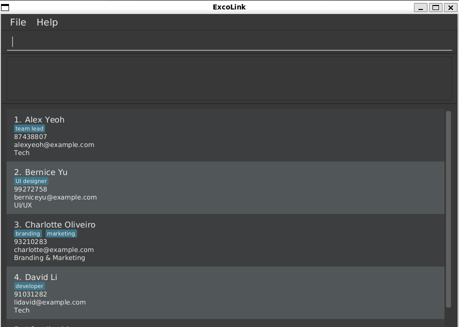

# ExcoLink

* ExcoLink is a desktop application designed for the executive committee of large university clubs with many sub-committees and members.  
  _Example usages:_
  *  retrieve and manage information such as member contact details, sub-committee assignment, and participation records quickly
* Users interact with ExcoLink primarily through a **command line interface (CLI)**, while the app also provides a **JavaFX graphical user interface (GUI)** for visualization.
* The codebase comes with **comprehensive user and developer documentation** to support both users and contributors.
* For detailed documentation of this project, refer to the **[ExcoLink Product Website](https://ay2526s1-cs2103t-t12-3.github.io/tp/)**.
* This project is based on the ExcoLink-Level3 project created by the [SE-EDU initiative](https://se-education.org).

