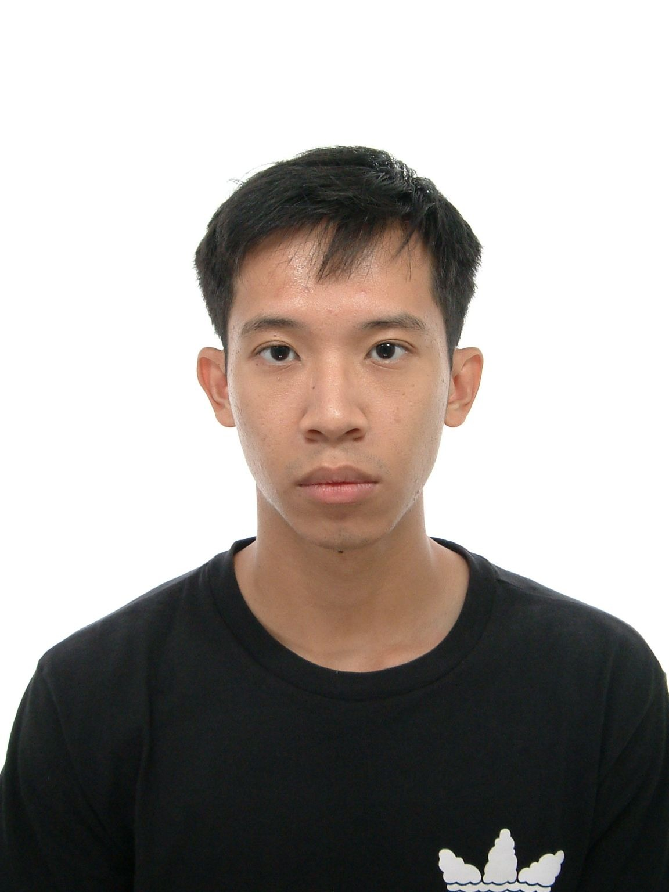

We are a team based in the [School of Computing, National University of Singapore](https://www.comp.nus.edu.sg).

You can reach us at the email `seer[at]comp.nus.edu.sg`

## Project team

### Glenn Chiang

[[github](https://github.com/Glenn-Chiang)]
[[portfolio](team/glenn-chiang.md)]

* Role: Team Lead

### Wang Weijie

[[github](http://github.com/weijie-wang227)] [[portfolio](team/johndoe.md)]

- Role: Developer
- Responsibilities: Data

### Ernest Seng

[[github](http://github.com/sengernest)] [[portfolio](team/sengernest.md)]

* Role: Developer
* Responsibilities: Logic

### Wei Chen

[[github](http://github.com/Whyudothiss)]
[[portfolio](team/johndoe.md)]

- Role: Developer
- Responsibilities: Dev Ops + Threading

### Deshpande Neeti

[[github](http://github.com/neet-it)]
[[portfolio](team/johndoe.md)]

- Role: Developer
- Responsibilities: UI
