- Table of Contents
  {:toc}

---

## Acknowledgements

ExcoLink is based on the [AddressBook Level 3 (AB3)](https://se-education.org/addressbook-level3/) project developed by
the [SE-EDU initiative](https://se-education.org/).
The original AB3 project provided the foundational architecture, design patterns, and testing framework for ExcoLink.
Portions of the source code and documentation were adapted or extended from AB3.
We thank the SE-EDU team for their open-source contribution, which made this project possible.

---

## **Setting up, getting started**

Refer to the guide [_Setting up and getting started_](SettingUp.md).

---

## **Design**

:bulb: **Tip:** The `.puml` files used to create diagrams are in this document `docs/diagrams` folder. Refer to the [_
PlantUML Tutorial_ at se-edu/guides](https://se-education.org/guides/tutorials/plantUml.html) to learn how to create and
edit diagrams.

### Architecture

The **_Architecture Diagram_** given above explains the high-level design of the App.

Given below is a quick overview of main components and how they interact with each other.

**Main components of the architecture**

**`Main`** (consisting of
classes [`Main`](https://github.com//AY2526S1-CS2103T-T12-3/tp/tree/master/src/main/java/seedu/excolink/Main.java)
and [`MainApp`](https://github.com//AY2526S1-CS2103T-T12-3/tp/tree/master/src/main/java/seedu/excolink/MainApp.java)) is
in charge of the app launch and shut down.

- At app launch, it initializes the other components in the correct sequence, and connects them up with each other.
- At shut down, it shuts down the other components and invokes cleanup methods where necessary.

The bulk of the app's work is done by the following four components:

- [**`UI`**](#ui-component): The UI of the App.
- [**`Logic`**](#logic-component): The command executor.
- [**`Model`**](#model-component): Holds the data of the App in memory.
- [**`Storage`**](#storage-component): Reads data from, and writes data to, the hard disk.

[**`Commons`**](#common-classes) represents a collection of classes used by multiple other components.

**How the architecture components interact with each other**

The _Sequence Diagram_ below shows how the components interact with each other for the scenario where the user issues
the command `delete 1`.

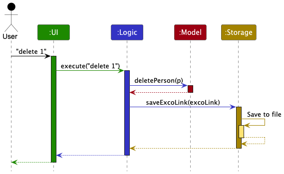

Each of the four main components (also shown in the diagram above),

- defines its _API_ in an `interface` with the same name as the Component.
- implements its functionality using a concrete `{Component Name}Manager` class (which follows the corresponding
  API `interface` mentioned in the previous point.

For example, the `Logic` component defines its API in the `Logic.java` interface and implements its functionality using
the `LogicManager.java` class which follows the `Logic` interface. Other components interact with a given component
through its interface rather than the concrete class (reason: to prevent outside component's being coupled to the
implementation of a component), as illustrated in the (partial) class diagram below.

The sections below give more details of each component.

### UI component

The **API** of this component is specified
in [`Ui.java`](https://github.com//AY2526S1-CS2103T-T12-3/tp/tree/master/src/main/java/seedu/excolink/ui/Ui.java)

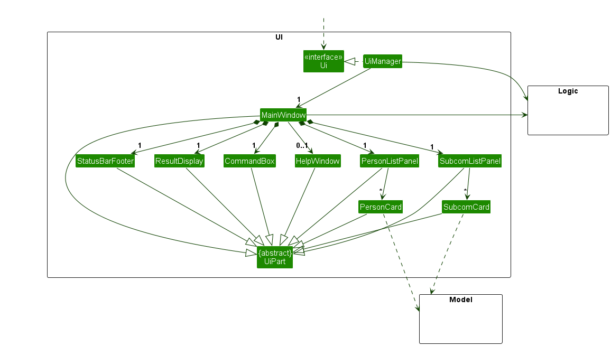

The UI consists of a `MainWindow` that is made up of parts e.g.`CommandBox`, `ResultDisplay`, `PersonListPanel`
, `StatusBarFooter` etc. All these, including the `MainWindow`, inherit from the abstract `UiPart` class which captures
the commonalities between classes that represent parts of the visible GUI.

The `UI` component uses the JavaFx UI framework. The layout of these UI parts are defined in matching `.fxml` files that
are in the `src/main/resources/view` folder. For example, the layout of
the [`MainWindow`](https://github.com//AY2526S1-CS2103T-T12-3/tp/tree/master/src/main/java/seedu/excolink/ui/MainWindow.java)
is specified
in [`MainWindow.fxml`](https://github.com//AY2526S1-CS2103T-T12-3/tp/tree/master/src/main/resources/view/MainWindow.fxml)

The `UI` component,

- executes user commands using the `Logic` component.
- listens for changes to `Model` data so that the UI can be updated with the modified data.
- keeps a reference to the `Logic` component, because the `UI` relies on the `Logic` to execute commands.
- depends on some classes in the `Model` component, as it displays `Person` object residing in the `Model`.

### Logic component

**
API** : [`Logic.java`](https://github.com//AY2526S1-CS2103T-T12-3/tp/tree/master/src/main/java/seedu/excolink/logic/Logic.java)

Here's a (partial) class diagram of the `Logic` component:

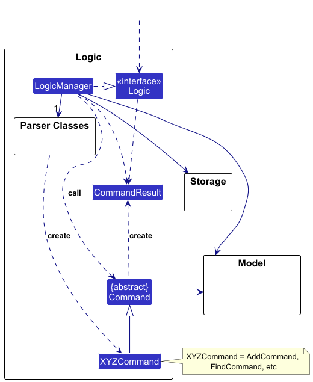

The sequence diagram below illustrates the interactions within the `Logic` component, taking `execute("delete 1")` API
call as an example.

:information_source: **Note:** The lifeline for `DeleteCommandParser` should end at the destroy marker (X) but due to a limitation of PlantUML, the lifeline continues till the end of diagram.

How the `Logic` component works:

1. When `Logic` is called upon to execute a command, it is passed to an `ExcoLinkParser` object which in turn creates a
   parser that matches the command (e.g., `DeleteCommandParser`) and uses it to parse the command.
1. This results in a `Command` object (more precisely, an object of one of its subclasses e.g., `DeleteCommand`) which
   is executed by the `LogicManager`.
1. The command can communicate with the `Model` when it is executed (e.g. to delete a person). 
   Note that although this is shown as a single step in the diagram above (for simplicity), in the code it can take
   several interactions (between the command object and the `Model`) to achieve.
1. The result of the command execution is encapsulated as a `CommandResult` object which is returned back from `Logic`.

Here are the other classes in `Logic` (omitted from the class diagram above) that are used for parsing a user command:

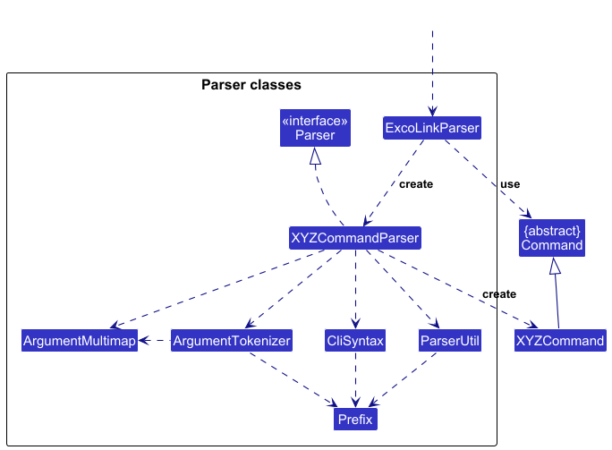

How the parsing works:

- When called upon to parse a user command, the `ExcoLinkParser` class creates an `XYZCommandParser` (`XYZ` is a
  placeholder for the specific command name e.g., `AddCommandParser`) which uses the other classes shown above to parse
  the user command and create a `XYZCommand` object (e.g., `AddCommand`) which the `ExcoLinkParser` returns back as
  a `Command` object.
- All `XYZCommandParser` classes (e.g., `AddCommandParser`, `DeleteCommandParser`, ...) inherit from the `Parser`
  interface so that they can be treated similarly where possible e.g, during testing.

### Model component

**
API** : [`Model.java`](https://github.com//AY2526S1-CS2103T-T12-3/tp/tree/master/src/main/java/seedu/excolink/model/Model.java)

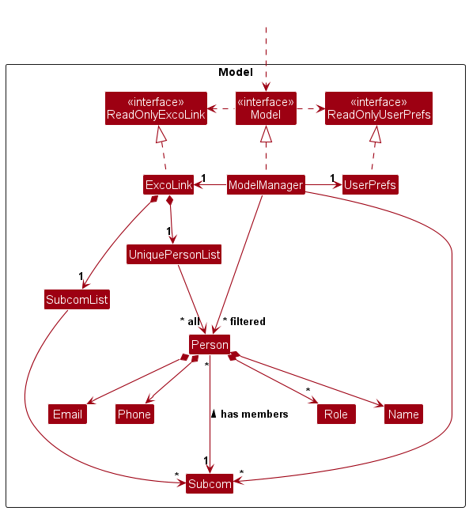

The `Model` component,

- stores the ExcoLink data i.e., all `Person` objects (which are contained in a `UniquePersonList` object).
- stores the currently 'selected' `Person` objects (e.g., results of a search query) as a separate _filtered_ list which
  is exposed to outsiders as an unmodifiable `ObservableList<Person>` that can be 'observed' e.g. the UI can be bound to
  this list so that the UI automatically updates when the data in the list change.
- stores a `UserPref` object that represents the user’s preferences. This is exposed to the outside as
  a `ReadOnlyUserPref` objects.
- does not depend on any of the other three components (as the `Model` represents data entities of the domain, they
  should make sense on their own without depending on other components)

:information_source: **Note:** An alternative (arguably, a more OOP) model is given below. It has a `Tag` list in the `ExcoLink`, which `Person` references. This allows `ExcoLink` to only require one `Tag` object per unique tag, instead of each `Person` needing their own `Tag` objects. 

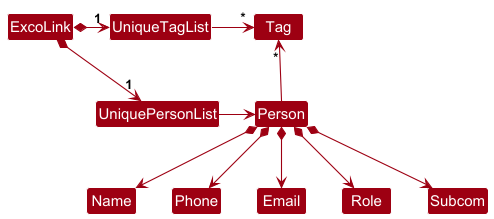

### Storage component

**
API** : [`Storage.java`](https://github.com//AY2526S1-CS2103T-T12-3/tp/tree/master/src/main/java/seedu/excolink/storage/Storage.java)

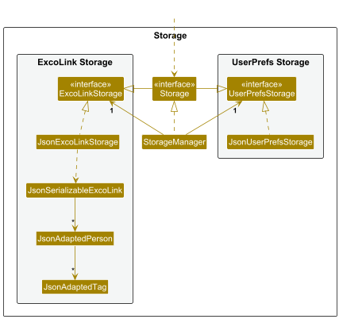

The `Storage` component,

- can save both ExcoLink data and user preference data in JSON format, and read them back into corresponding objects.
- inherits from both `ExcoLinkStorage` and `UserPrefStorage`, which means it can be treated as either one (if only the
  functionality of only one is needed).
- depends on some classes in the `Model` component (because the `Storage` component's job is to save/retrieve objects
  that belong to the `Model`)

### Common classes

Classes used by multiple components are in the `seedu.excolink.commons` package.

---

## **Implementation**

This section describes some noteworthy details on how certain features are implemented.

### \[Proposed\] Undo/redo feature

#### Proposed Implementation

The proposed undo/redo mechanism is facilitated by `VersionedExcoLink`. It extends `ExcoLink` with an undo/redo history,
stored internally as an `excoLinkStateList` and `currentStatePointer`. Additionally, it implements the following
operations:

- `VersionedExcoLink#commit()`— Saves the current ExcoLink state in its history.
    - `VersionedExcoLink#undo()`— Restores the previous ExcoLink state from its history.
    - `VersionedExcoLink#redo()`— Restores a previously undone ExcoLink state from its history.

These operations are exposed in the `Model` interface as `Model#commitExcoLink()`, `Model#undoExcoLink()`
and `Model#redoExcoLink()` respectively.

Given below is an example usage scenario and how the undo/redo mechanism behaves at each step.

Step 1. The user launches the application for the first time. The `VersionedExcoLink` will be initialized with the
initial app state, and the `currentStatePointer` pointing to that single app state.

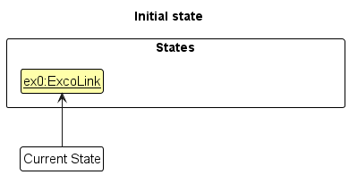

Step 2. The user executes `delete 5` command to delete the 5th member in the app. The `delete` command
calls `Model#commitExcoLink()`, causing the modified state of the app after the `delete 5` command executes to be saved
in the `excoLinkStateList`, and the `currentStatePointer` is shifted to the newly inserted app state.

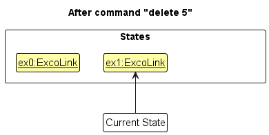

Step 3. The user executes `add n/David …​` to add a new member. The `add` command also calls `Model#commitExcoLink()`,
causing another modified app state to be saved into the `excoLinkStateList`.

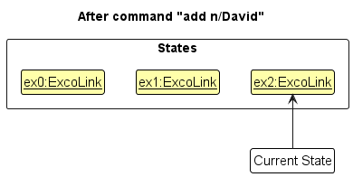

:information_source: **Note:** If a command fails its execution, it will not call `Model#commitExcoLink()`, so the app state will not be saved into the `excoLinkStateList`.

Step 4. The user now decides that adding the member was a mistake, and decides to undo that action by executing
the `undo` command. The `undo` command will call `Model#undoExcoLink()`, which will shift the `currentStatePointer` once
to the left, pointing it to the previous app state, and restores the app to that state.

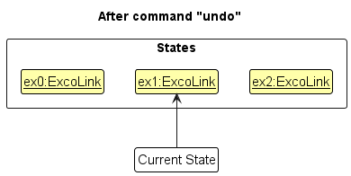

:information_source: **Note:** If the `currentStatePointer` is at index 0, pointing to the initial ExcoLink state, then there are no previous ExcoLink states to restore. The `undo` command uses `Model#canUndoExcoLink()` to check if this is the case. If so, it will return an error to the user rather
than attempting to perform the undo.

The following sequence diagram shows how an undo operation goes through the `Logic` component:

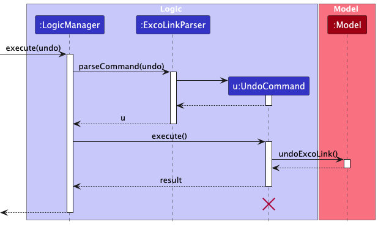

:information_source: **Note:** The lifeline for `UndoCommand` should end at the destroy marker (X) but due to a limitation of PlantUML, the lifeline reaches the end of diagram.

Similarly, how an undo operation goes through the `Model` component is shown below:

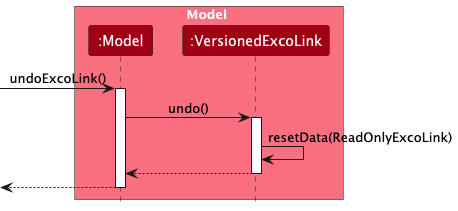

The `redo` command does the opposite — it calls `Model#redoExcoLink()`, which shifts the `currentStatePointer` once to
the right, pointing to the previously undone state, and restores the app to that state.

:information_source: **Note:** If the `currentStatePointer` is at index `excoLinkStateList.size() - 1`, pointing to the latest app state, then there are no undone ExcoLink states to restore. The `redo` command uses `Model#canRedoExcoLink()` to check if this is the case. If so, it will return an error to the user rather than attempting to perform the redo.

Step 5. The user then decides to execute the command `list`. Commands that do not modify the app, such as `list`, will
usually not call `Model#commitExcoLink()`, `Model#undoExcoLink()` or `Model#redoExcoLink()`. Thus,
the `excoLinkStateList` remains unchanged.

Step 6. The user executes `clear`, which calls `Model#commitExcoLink()`. Since the `currentStatePointer` is not pointing
at the end of the `excoLinkStateList`, all app states after the `currentStatePointer` will be purged. Reason: It no
longer makes sense to redo the `add n/David …​` command. This is the behavior that most modern desktop applications
follow.

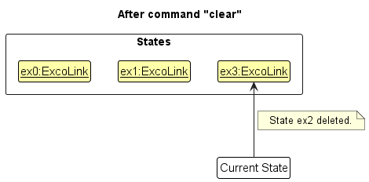

The following activity diagram summarizes what happens when a user executes a new command:

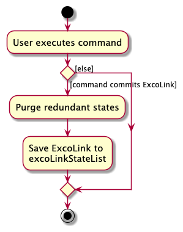

#### Design considerations:

**Aspect: How undo & redo executes:**

- **Alternative 1 (current choice):** Saves the entire app.

    - Pros: Easy to implement.
    - Cons: May have performance issues in terms of memory usage.

- **Alternative 2:** Individual command knows how to undo/redo by
  itself.
    - Pros: Will use less memory (e.g. for `delete`, just save the member being deleted).
    - Cons: We must ensure that the implementation of each individual command are correct.

---

## **Documentation, logging, testing, configuration, dev-ops**

- [Documentation guide](Documentation.md)
- [Testing guide](Testing.md)
- [Logging guide](Logging.md)
- [Configuration guide](Configuration.md)
- [DevOps guide](DevOps.md)

---

## **Appendix: Requirements**

### Product scope

**Target user profile**:

- exco members of large university clubs or CCAs with many sub-committees and members with different roles
- prefer desktop apps over other types
- can type fast
- prefers typing to mouse interactions
- is reasonably comfortable using CLI apps

**Value proposition**: allows exco members to quickly retrieve and manage the information of their members, such as
their contact information, sub-committee etc.

### User stories

Priorities: High (must have) - `* * *`, Medium (nice to have) - `* *`, Low (unlikely to have) - `*`

| Priority | As a …​          | I want to …​                                                             | So that I can …​                                                       |
| -------- | ---------------- | ------------------------------------------------------------------------ | ---------------------------------------------------------------------- |
| `* * *`  | Exco member      | view a list of all current members                                       | have a full overview of the membership                                 |
| `* * *`  | Exco member      | add new members with their information e.g. name and contact information | maintain updated membership records                                    |
| `* * *`  | Exco member      | remove a member                                                          | eliminate outdated records                                             |
| `* * *`  | Exco member      | view a member’s information fields                                       | know their details easily                                              |
| `* * *`  | Exco member      | create a new sub-committee                                               | add members to sub-committees                                          |
| `* * *`  | Exco member      | delete a sub-committee                                                   | update the existing sub-comittees                                      |
| `* * *`  | Exco member      | assign members to sub-committees                                         | make responsibilities clear                                            |
| `* * *`  | Exco member      | unassign members from a sub-comittee                                     | update the responsibilities of a member                                |
| `* * *`  | Exco member      | view the list of members in a sub-committee                              | contact the members of that sub-committee                              |
| `* * * ` | Exco member      | view a list of all sub-committees                                        | understand the structure of the exco                                   |
| `* * *`  | Exco member      | assign members roles                                                     | retrieve contact information of members of a certain role              |
| `* * *`  | Exco member      | unassign a member's role                                                 | update the role of a member                                            |
| `* *`    | Exco member      | search for a member by name                                              | quickly access their details                                           |
| `* *`    | Exco member      | update a member’s information fields                                     | keep records current                                                   |
| `* *`    | Exco member      | reassign members to a different sub-committee                            | keep responsibilities flexible                                         |
| `*`      | Exco member      | view a member’s participation record                                     | evaluate their involvement                                             |
| `*`      | Exco member      | mark attendance for an event                                             | track participation                                                    |
| `*`      | Exco member      | filter members by role                                                   | retrieve contact information of members with specific responsibilities |
| `*`      | Exco member      | search members by year of joining                                        | identify seniority                                                     |
| `*`      | PD               | view the distribution of members across sub-committees                   | spot imbalances                                                        |
| `*`      | Sub-committee/PD | log notes on member performance                                          | keep comprehensive records                                             |

### Use cases

(For all use cases below, the **System** is the `ExcoLink` app and
the **Actor** is the `user`, unless specified otherwise)

#### UC1: Add Member

**MSS:**

1. User enters command to add member.
2. System adds the new member and displays success message.

   Use case ends.

**Extensions:**

- 1a. System detects missing or invalid parameter.
    - 1a1. System displays error.
    - 1a2. User enters new data.
    - Steps 1a1-1a2 are repeated until the data entered is correct.

      Use case ends.
- 1b. System detects duplicate member to be added.
    - 1b1. System displays error.
    - 1b2. User enters new data.
    - Steps 1b1-1b2 are repeated until the data entered is correct.

      Use case ends.

**Guarantees:**

- Member is stored if input is valid.
- No duplicate members will be added.

---

#### UC2: Remove Member

**Preconditions:**

- Member exists
- UI is displaying member list

  Use case ends.

**MSS:**

1. User enters command to remove member.
2. System deletes the member and displays success message.

   Use case ends.

**Extensions:**

- 1a. User enters invalid index.
    - 1a1. System displays error.
    - 1a2. User enters new data.
    - Steps 1a1-1a2 are repeated until the data entered is correct.

      Use case ends.

---

#### UC3: Edit Member

**Preconditions:**

- User exists
- UI is displaying member list

**MSS:**

1. User enters command to edit a member's information field.
2. System edits the member's specified field and displays success message.

   Use case ends.

**Extensions:**

- 1a. User enters invalid index.
    - 1a1. System displays error.
    - 1a2. User enters new data.
    - Steps 1a1-1a2 are repeated until the data entered is correct.

      Use case ends.
- 1b. User enters an invalid information field
    - 1b1. System displays error.
    - 1b2. User enters new data.
    - Steps 1b1-1b2 are repeated until the data entered is correct.

      Use case ends.

---

#### UC4: View All Members

**MSS:**

1. User enters command to view all members.
2. System displays all members.

   Use case ends.

---

#### UC5: Create Subcommittee

**MSS:**

1. User enters command to create subcommittee.
2. System creates the subcommittee and displays success message.

   Use case ends.

**Extensions:**

- 1a. User enters invalid subcommittee name.
    - 1a1. System displays error.
    - 1a2. User enters new data.
    - Steps 1a1-1a2 are repeated until the data entered is correct.

      Use case ends.
- 1b. System detects duplicate subcommittee to be added.
    - 1b1. System displays error.
    - 1b2. User enters new data.
    - Steps 1b1-1b2 are repeated until the data entered is correct.

      Use case ends.

---

#### UC6: Delete Subcommittee

**Preconditions:**

- UI is displaying subcommmittee list

**MSS:**

1. User enters command to delete subcommittee.
2. System deletes the subcommittee and displays success message.

   Use case ends.

**Extensions:**

- 1a. User enters invalid index.
    - 1a1. System displays error.
    - 1a2. User enters new data.
    - Steps 1a1-1a2 are repeated until the data entered is correct.

      Use case ends.

---

#### UC7: View all Subcommittees

**MSS:**

1. User enters command to view all subcommittees.
2. System displays all subcommittees.

   Use case ends.

---

#### UC8: Assign Member to Subcommittee

**Preconditions:**

- Member exists
- Subcommittee exists
- UI is displaying member list

**MSS:**

1. User enters command to assign member to subcommittee.
2. System assigns member to subcommittee and displays success message.

   Use case ends.

**Extensions:**

- 1a. User enters invalid index.
    - 1a1. System displays error.
    - 1a2. User enters new data.
    - Steps 1a1-1a2 are repeated until the data entered is correct.

      Use case ends.
- 1b. User enters an invalid subcommittee name
    - 1a1. System displays error.
    - 1a2. User enters new data.
    - Steps 1a1-1a2 are repeated until the data entered is correct.

      Use case ends.

#### UC9: Unassign Member from Subcommittee

**Preconditions:**

- Member exists
- Subcommittee exists
- Member is in a subcommittee
- UI is displaying member list

**MSS:**

1. User enters command to unassign member from subcommittee.
2. System unassigns member from subcommittee and displays success message.

   Use case ends.

**Extensions:**

- 1a. User enters invalid index.
    - 1a1. System displays error message.
    - 1a2. User enters new index.
    - Steps 1a1-1a2 are repeated until the data entered is correct.

      Use case ends.

- 1b. Member is not in a Subcommittee.
    - 1b1. System displays error message.
    - 1b2. User enters new index.
    - Steps 1b1-1b2 are repeated until the data entered is correct.

      Use case ends.

---

#### UC10: View all Members in Subcommittee

**Preconditions:**

- Subcommittee exists

**MSS:**

1. User enters command to list all members of the specified subcommittee.
2. System retrieves all members belonging to that subcommittee.
3. System displays the list of members in the subcommittee.

   Use case ends.

**Extensions:**

- 1a. User enters invalid subcommittee name.
    - 1a1. System displays error.
    - 1a2. User enters new data.
    - Steps 1a1-1a2 are repeated until the data entered is correct.

      Use case ends.
- 1b. The specified subcommittee has no members.
    - 1b1. System displays an empty list indicating there are no members currently assigned to this subcommittee.

      Use case ends.

---

#### UC11: Assign Member to Role

**Preconditions:**

- Member exists
- UI is displaying member list

**MSS:**

1. User enters command to assign member to role.
2. System assigns the role to the member and displays success message.

   Use case ends.

**Extensions:**

- 1a. User enters invalid index.
    - 1a1. System displays error.
    - 1a2. User enters new data.
    - Steps 1a1-1a2 are repeated until the data entered is correct.

      Use case ends.
    - 1b. User enters invalid role name.
        - 1b1. System displays error.
        - 1b2. User enters new data.
        - Steps 1b1-1b2 are repeated until the data entered is correct.

      Use case ends.
    - 1c. User enters a role that is a duplicate of the member's existing role.
        - 1c1. System displays error.
        - 1c2. User enters new data.
        - Steps 1c1-1c2 are repeated until the data entered is correct.

      Use case ends.
    - 1d. User enters multiple roles, of which one or more are duplicates of the member's existing role(s).
        - 1d1. System rejects the command with an error and adds none of the roles.
        - 1d2. User enters new data.
        - Steps 1d1-1d2 are repeated until the data entered is correct.

      Use case ends.

---

#### UC12: Remove Role of Member

**Preconditions:**

- Member exists
    - Role exists
    - UI is displaying member list

**MSS:**

1. User enters command to remove a role from member.
2. System deletes the role of the member and displays success message.

   Use case ends.

**Extensions:**

- 1a. User enters invalid index.
    - 1a1. System displays error.
    - 1a2. User enters new data.
    - Steps 1a1-1a2 are repeated until the data entered is correct.

      Use case ends.
- 1b. System cannot find role to be deleted.
    - 1b1. System displays error.
    - 1b2. User enters new data.
    - Steps 1b1-1b2 are repeated until the data entered is correct.

      Use case ends.
- 1c. User enters multiple roles, with 1 or more invalid roles.
    - 1c1. System rejects the command with an error and deletes none of the roles.
    - 1c2. User enters new data.
    - Steps 1c1-1c2 are repeated until the data entered is correct.

      Use case ends.

### Non-Functional Requirements

1. Should work on any _mainstream OS_ as long as it has Java `17` installed.
2. Should be able to hold up to 1000 members without a noticeable sluggishness in performance for typical usage.
3. A user with above average typing speed for regular English text (i.e. not code, not system admin commands) should be
   able to accomplish most of the tasks faster using commands than using the mouse.
4. Member attributes (e.g., name, role, subcom) must be persistent and retained until explicitly deleted by an admin.
5. All data must be stored in a json file
6. The system must respond to user actions (e.g., creating a subcom, editing a user) within 2 seconds under normal load.
7. The system must be usable by a non-technical club leader with less than 1 hour of onboarding/training.

### Glossary

- **CLI**: (Command Line Interface) A text based interface where users interact with the system using commands.
- **Exco**: Executive committee of the club. Includes all members in leadership or administrative roles.
- **GUI**: (Graphical User Interface) A visual interface that allows users to use software through graphical elements
  like buttons, icons, and windows.
- **Mainstream OS**: Windows, Linux, Unix, MacOS
- **Member**: A person in the club whose record is stored in the system. Includes basic details like name, phone number,
  email.
- **PD**: Project Director, person who oversees one or more major events or projects within the club
- **New Exco Member**: New executive committee member of the club. The member is new to the system.
- **Role**: The responsibility assigned to a member. Members can have multiple roles.
- **Subcommittee**: A smaller group under the main Exco, can be responsible for specific functions. Members may belong
  to only one Sub-committees.

---

## **Appendix: Instructions for manual testing**

Given below are instructions to test the app manually.

:information_source: **Note:** These instructions only provide a starting point for testers to work on;
testers are expected to do more *exploratory* testing.

### Launch and shutdown

1. Initial launch

    1. Download the jar file and copy into an empty folder

    1. Double-click the jar file  
       Expected: Shows the GUI with a set of sample contacts. The window size may not be optimum.

    1. Saving window preferences

        1. Resize the window to an optimum size. Move the window to a different location. Close the window.

        1. Re-launch the app by double-clicking the jar file. 
           Expected: The most recent window size and location are retained.

### Deleting a member

1. Deleting a member while all members are being shown

    1. Prerequisites: List all members using the `list` command. Multiple members in the list.

    1. Test case: `delete 1` 
       Expected: First contact is deleted from the list. Details of the deleted contact shown in the status message.

    1. Test case: `delete 0` 
       Expected: No member is deleted. Error details shown in the status message.

    1. Other incorrect delete commands to try: `delete`, `delete x`, `...` (where x is larger than the list size) 
       Expected: Similar to previous.

### Creating a subcommittee
1. Creating a new subcommittee
    1. Prerequisites: ExcoLink does not already contain a subcommittee named "Logistics" (case-insensitive).
   
    1. Test case: `add-sc sc/Logistics`  
       Expected: If not already in subcommittee list view, GUI switches to subcommittee list view. New subcommittee
       "Logistics" is added to the list.
   
    1. Test case: `add-sc sc/UI/UX`  
      Expected:  No subcommittee is added and list view does not change. Error shown in status message indicating that
       the subcommittee name is invalid.
   

2. Attempting to create a duplicate subcommittee
    1. Prerequisites: ExcoLink already contains a subcommittee named "Tech" (case-insensitive). 
       The sample data should already guarantee this.
   
    1. Test case: `add-sc sc/Tech`  
       Expected: No subcommittee is added and list view does not change. Error shown in status message indicating that
       the subcommittee already exists.

    1. Test case: `add-sc sc/tEch`  
      Expected: Similar to previous.

### Listing all subcommittees

### Deleting a subcommittee

### Saving data

1. Dealing with missing data files

    1. Delete the `data/excoLink.json` file.
    2. Relaunch the app.
       Expected: The app launches with sample data.

2. Dealing with corrupted data files

    1. Corrupt the `data/excoLink.json` file.
    2. Relaunch the app.
       Expected: The app launches with empty data.

---

## **Appendix: Planned Enhancements**

Team size: 5

1. **Modify member name constraints to allow slashes (`/`)**:
   Currently, member names are not allowed to contain slashes (`/`) as it is used as a command delimiter. However,
   this prevents adding valid values like `s/o`. We plan to change the command delimiter to another symbol such as
   `=` or `:` which are extremely unlikely, if not impossible, to be a valid part of a name.
2. **Implement split-screen view for member list and subcommittee list**:
   Currently, our GUI can only display one list view at a time. As such, certain commands can be run only in the member
   list view, or only in the subcommittee list view. In such cases, the user must use `list` to switch to the member
   list view and `list-sc` to switch to the subcommittee list view. This may pose a slight inconvenience to some users.
   We plan
   to implement a split-screen view that displays the member list on the left and the subcommittee list on the right,
   allowing the user to view both lists at once and execute any command at any time.
