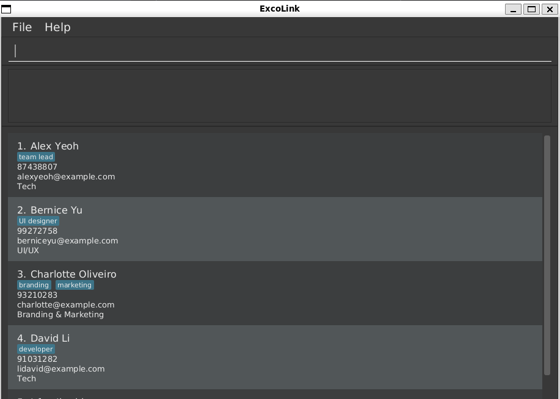

ExcoLink is a **desktop app for managing club members and subcommittees, optimized for use via a Command Line Interface (CLI)** while still having the benefits of a Graphical User Interface (GUI). If you can type fast, ExcoLink can get your member management tasks done faster than traditional GUI apps.

* Table of Contents
  {:toc}

--------------------------------------------------------------------------------------------------------------------

## Quick start

1. Ensure you have Java `17` or above installed in your Computer. 
   **Mac users:** Ensure you have the precise JDK version prescribed [here](https://se-education.org/guides/tutorials/javaInstallationMac.html).

1. Download the latest `.jar` file from [here](https://github.com/AY2526S1-CS2103T-T12-3/tp/releases).

1. Copy the file to the folder you want to use as the _home folder_ for your ExcoLink.

1. Open a command terminal, `cd` into the folder you put the jar file in, and use the `java -jar excolink.jar` command to run the application. 
   A GUI similar to the below should appear in a few seconds. Note how the app contains some sample data. 
   

1. Type the command in the command box and press Enter to execute it. e.g. typing **`help`** and pressing Enter will open the help window. 
   Some example commands you can try:

    * `list` : Lists all members.
    * `add n/John Doe p/98765432 e/johnd@example.com` : Adds a member named `John Doe` to ExcoLink.
    * `delete 1` : Deletes the 1st member shown in the current list.
    * `exit` : Exits the app.

1. Refer to the [Features](#features) below for details of each command.

--------------------------------------------------------------------------------------------------------------------

## Features

**:information_source: Notes about the command format:** 

* Words in `UPPER_CASE` are the parameters to be supplied by the user. 
  e.g. in `add n/NAME`, `NAME` is a parameter which can be used as `add n/John Doe`.

* Items in square brackets are optional. 
  e.g `assign-role INDEX [r/ROLE]` can be used as `assign-role 1 r/Treasurer`.

* Items with `…` after them can be used multiple times including zero times. 
  e.g. `[r/ROLE]…` can be used as ` ` (i.e. 0 times), `r/Treasurer`, `r/President r/Secretary`, etc.

* Parameters can be in any order. 
  e.g. if the command specifies `n/NAME p/PHONE e/EMAIL`, `p/PHONE n/NAME e/EMAIL` is also acceptable.

* Extraneous parameters for commands that do not take in parameters (such as `help`, `list`, and `exit`) will be ignored. 
  e.g. if the command specifies `help 123`, it will be interpreted as `help`.

* If you are using a PDF version of this document, be careful when copying and pasting commands that span multiple lines as space characters surrounding line-breaks may be omitted when copied over to the application.

---

### Viewing help : `help`

Shows a message explaining how to access the help page.

Format: `help`

---

### Adding a member: `add`

Adds a member to ExcoLink.

Format: `add n/NAME p/PHONE e/EMAIL`

Examples:
* `add n/John Doe p/98765432 e/johnd@example.com`
* `add n/Alice Tan p/91234567 e/alice@example.com`

---

### Listing all members : `list`

Shows a list of all members in ExcoLink.

Format: `list`

---

### Editing a member : `edit`

Edits the specified field/s of a specified member from ExcoLink.

Format: `edit INDEX n/NAME p/PHONE e/EMAIL r/ROLE sc/SUBCOMMITTEE`

* Edits the specified `FIELD` of the member at the specified `INDEX`.
* The index refers to the index number shown in the displayed member list.
* The index **must be a positive integer** 1, 2, 3, …​
* At least **1 out of the 5** fields are compulsory in the command.

Example:
* `list` followed by `edit 2 r/team lead` edits the role of the 2nd member in the list to "team lead".

---

### Deleting a member : `delete`

Deletes the specified member from ExcoLink.

Format: `delete INDEX`

* Deletes the member at the specified `INDEX`.
* The index refers to the index number shown in the displayed member list.
* The index **must be a positive integer** 1, 2, 3, …​

Examples:
* `list` followed by `delete 2` deletes the 2nd member in the list.

---

### Creating a subcommittee : `add-sc`

Creates a new subcommittee.

Format: `add-sc sc/SUBCOMMITTEE`

Examples:
* `add-sc sc/Publicity`

---

### Listing all subcommittees : `list-sc`

Shows a list of all subcommittees in ExcoLink.

Format: `list-sc`

---

### Deleting a subcommittee : `delete-sc`

Deletes the specified subcommittee.

Format: `delete-sc INDEX`

* Deletes the subcommittee at the specified `INDEX`.
* The index refers to the index number shown in the displayed subcommittee list.
* The index **must be a positive integer** 1, 2, 3, …​

Examples:
* `list-sc` followed by `delete-sc 1` deletes the 1st subcommittee in the list.

---

### Assigning a member to a subcommittee : `assign-sc`

Assigns a member to a subcommittee.

Format: `assign-sc INDEX sc/SUBCOMMITTEE`

Examples:
* `assign-sc 2 sc/Publicity`

---

### Unassigning a member from a subcommittee : `unassign-sc`

Removes a member from their assigned subcommittee.

Format: `unassign-sc INDEX`

Examples:
* `unassign-sc 2`

---

### Viewing members in a subcommittee : `list-sc-members`

Shows all members belonging to a specified subcommittee.

Format: `list-sc-members sc/SUBCOMMITTEE`

Examples:
* `list-sc-members sc/Publicity`

---

### Assigning a role to a member : `assign-role`

Assigns a role to a member. Members can hold multiple roles.

Format: `assign-role INDEX r/ROLE`

Examples:
* `assign-role 1 r/Treasurer`
* `assign-role 3 r/President`

---

### Removing a role from a member : `delete-role`

Removes a role from a member.

Format: `delete-role INDEX r/ROLE`

Examples:
* `delete-role 1 r/Treasurer`

---

### Exiting the program : `exit`

Exits the program.

Format: `exit`

---

### Saving the data

ExcoLink data are saved in the hard disk automatically after any command that changes the data. There is no need to save manually.

---

### Editing the data file

ExcoLink data are saved automatically as a JSON file `[JAR file location]/data/excolink.json`. Advanced users are welcome to update data directly by editing that data file.

:exclamation: **Caution:**
If your changes to the data file make its format invalid, ExcoLink will discard all data and start with an empty data file at the next run. Hence, it is recommended to take a backup of the file before editing it. 
Furthermore, certain edits can cause the ExcoLink to behave in unexpected ways (e.g., if a value entered is outside of the acceptable range). Therefore, edit the data file only if you are confident that you can update it correctly.

---

## FAQ

**Q**: How do I transfer my data to another Computer? 
**A**: Install the app in the other computer and overwrite the empty data file it creates with the file that contains the data of your previous ExcoLink home folder.

---

## Known issues

1. **When using multiple screens**, if you move the application to a secondary screen, and later switch to using only the primary screen, the GUI will open off-screen. The remedy is to delete the `preferences.json` file created by the application before running the application again.
2. **If you minimize the Help Window** and then run the `help` command (or use the `Help` menu, or the keyboard shortcut `F1`) again, the original Help Window will remain minimized, and no new Help Window will appear. The remedy is to manually restore the minimized Help Window.

---

## Command summary

Action | Format, Examples
--------|------------------
**Add Member** | `add n/NAME p/PHONE e/EMAIL`   e.g., `add n/John Doe p/98765432 e/johnd@example.com`
**Delete Member** | `delete INDEX`   e.g., `delete 1`
**List Members** | `list`
**Add Subcommittee** | `add-sc sc/SUBCOMMITTEE`   e.g., `add-sc sc/Publicity`
**Delete Subcommittee** | `delete-sc INDEX`   e.g., `delete-sc 1`
**List Subcommittees** | `list-sc`
**Assign Member to Subcommittee** | `assign-sc INDEX sc/SUBCOMMITTEE`   e.g., `assign-sc 1 sc/Tech`
**Unassign Member from Subcommittee** | `unassign-sc INDEX`   e.g., `unassign-sc 1`
**List Members in Subcommittee** | `list-sc-members sc/SUBCOMMITTEE`   e.g., `list-sc-members sc/Publicity`
**Assign Role to Member** | `assign-role INDEX r/ROLE`   e.g., `assign-role 1 r/President`
**Delete Role from Member** | `delete-role INDEX r/ROLE`   e.g., `delete-role 1 r/Treasurer`
**Help** | `help`
**Exit** | `exit`

---

## Glossary

### App terms

- **Exco**: (Executive committee) Executive committee of the club. Includes all members in leadership or administrative roles.
- **Member**: A person in the club whose record is stored in the system. Includes basic details like name, phone number,
    email.
- **Role**: The responsibility assigned to a member. Members can have multiple roles.
- **Subcommittee**: A smaller group within the main executive committee, responsible for specific tasks such as Publicity, Tech or Logistics. Members may belong
    to one or more Subcommittees.

### Technical Terms

- **CLI**: (Command Line Interface) A text-based interface where users interact with the system using commands.
- **GUI**: (Graphical User Interface) A visual interface that allows users to use software through graphical elements like buttons, icons, and windows.
- **Java 17**: A version of the Java programming language and platform required to run ExcoLink. It must be installed on your computer before using the app.
- **JSON**: (JavaScript Object Notation) A text-based format used to store data. 
